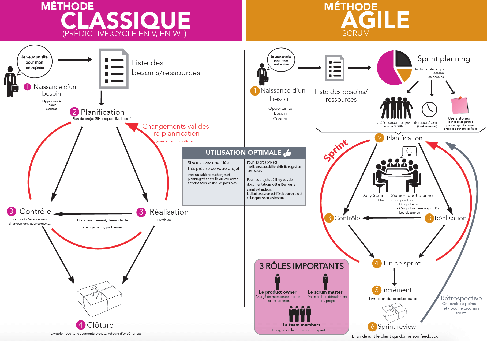

## Basic CEO
## Media Queries

## Fetch
    l'api fetch est une solution moderne qui vient remplacer XHR elle a été introduite récemment dan sles navigateur pour rendre les requ$etes HTTP asynchrones plus simples en JavaScript, à la fois pour les développeurs et pour les autres APIs qui utilisent cette technologies.
---
## XHR
    XMLHttpRequest est un objet du navigateur accessible en JavaScript qui permet d'obtenir des données au format XML, JSON, mais aussi HTML, ou même un simple texte à l'aide de requêtes HTTP.
---
## NODE
    Permet d'utiliser le langage JavaScript sur le serveur et donc de faire du JavaScript en dehors du navigateur.

## NPM
    Node Package Module
        -Gestionnaire de paquets
        -Gère les dépendances -> si un module a besoin d'ujn autre module pour fonctionner, NPM ira le télécharger automatiquement.
---
## BEM & OOCSS
    Méthodologie de nommage des classes css
    Ensemble de bonnes pratiques, de règles et de conseils.
## OOCSS
    Object Oriented CSS
    Repose sur 2 grands principes :

    Séparation de la structure et de l’apparence
    Séparation du conteneur et du contenu
## BEM
BEM est l'acronyme de Block, Element, Modifier :

    -Bloc est une entité indépendante, une « brique » de l'application ou de la page Web. Un bloc forme son propre contexte autonome.

    -Elément est une partie d'un bloc.

    -Modificateur est une propriété qui sert à créer des variantes, pour faire des modifications minimes comme changer des couleurs. Il existe des modificateurs de blocs et des modificateurs d'éléments.

La méthodologie BEM établit ensuite trois règles essentielles :

    Les blocs et les éléments doivent chacun avoir un nom unique, lequel sera utilisé comme classe CSS ;
    Les sélecteurs CSS ne doivent pas utiliser les noms des éléments HTML (pas de .menu td) ;
    Les cascades dans les sélecteurs CSS devraient être évitées.

Pertinence de BEM

    -La propreté
    -La scalability et une architecture par composants
    -Une syntaxe BEM… jolie !
---
## WebPack
Webpack a pour objectif de vous faciliter la vie, notamment en vous aidant à organiser votre application JS en modules.

Nativement, Webpack s’occupe uniquement de ressources JavaScript. Webpack propose un système de loader qui permet de transformer tout et n’importe quoi en JavaScript (mais pas que). Ainsi, tout est consommable en tant que module.

Webpack prend en charge la fonction require() (connue et utilisée dans node.js et browserify) et permet de définir des nouveaux comportements.

---

## Framework

[Que choisir entre React ou Angular ?](https://www.easypartner.fr/blog/que-choisir-entre-react-ou-angular/)

[Angular, React ou Vue ?](https://formationjavascript.com/angular2-vs-react/)

---

## Progressive web app

Les progressive web apps E-commerce (PWA) sont là pour résoudre ce problème. Plus besoin de télécharger une application. Grace aux dernières technologies il est possible d’embarquer dans un site web tous les éléments nécessaires pour simuler une application.

### Le service worker

Le service worker est un peu la base des progressive web app. Pas de service worker, pas de PWA. C’est un petit programme qui va tourner en parallèle des pages web et qui va permettre de générer les fonctions non prises en charges par les pages web. Le service worker va par exemple gérer les notifications le « mode offline » de votre PWA.

[C'est quoi un service worker ? Petite définition](http://mobibot.io/blog/1162/cest-quoi-un-service-worker-petite-definition.html)

### Le Web App Manifest

Le manifest est un des éléments fondamentaux dans les Progressive web apps E-commerce. C’est lui qui va transformer votre site en « véritable » web app. Il va gérer en effet les éléments qui vont permettent d’afficher votre site e-commerce mobile en tant qu’application sur le téléphone de votre internaute. C’est lui qui va prendre en charge l’icon qui s’affichera et qui va « meubler » votre application le temps que les infos se chargent.

---

## Web Socket

---

## Méthodologie

### Scrum

Pour rappel Scrum est une méthode agile dédiée à la « gestion de projet ». Cette méthode de gestion, ou plutôt ce Framework de management de projet, à pour objectif d’améliorer la productivité de son équipe.

[Définition Scrum en moins de 10 minutes](https://www.thierry-pigot.fr/scrum-en-moins-de-10-minutes/)

---

## Web Component

[Web Components: from zero to hero](https://dev.to/thepassle/web-components-from-zero-to-hero-4n4m)

Les composants web sont une suite de technologies connectées servant à rendre des éléments réutilisables sur le web. L'essentiel des discussions a tourné autour du DOM fantôme (shadow DOM), mais la technologie qui apportera sans doute le plus de transformations est ce qu'on appelle les custom elements (les éléments personnalisés)

    . Les Custom Elements ;
        une méthode vous permettant de définir vos propres éléments
    . Les Templates ;
    . Le Shadow DOM:
    Shadow DOM est une nouvelle fonctionnalité DOM qui vous aide à créer des composants. Vous pouvez considérer le shadow DOM comme un sous-arbre à l' intérieur de votre élément.
    [What is the Shadow DOM?](https://bitsofco.de/what-is-the-shadow-dom/)

---

## Itérateurs et générateurs

### [Itérateurs](https://developer.mozilla.org/fr/docs/Web/JavaScript/Guide/iterateurs_et_generateurs#It%C3%A9rateurs) :

Un itérateur est un objet sachant comment accéder aux éléments d'une collection un par un et qui connait leur position dans la collection.

### [Itérables](https://developer.mozilla.org/fr/docs/Web/JavaScript/Guide/iterateurs_et_generateurs#It%C3%A9rables) :

Un objet est considéré comme itérable s'il définit le comportement qu'il aura lors de l'itération (par exemple les valeurs qui seront utilisées dans une boucle for...of).

### [Générateurs](https://developer.mozilla.org/fr/docs/Web/JavaScript/Guide/iterateurs_et_generateurs#G%C3%A9n%C3%A9rateurs) :

Les itérateurs personnalisés sont un outil utile mais leur création peut s'avérer complexe et il faut maintenir leur état interne. Avec les générateurs, on peut définir une seule fonction qui est un algorithme itératif et qui peut maintenir son état.

---
## Git & Github

Git : est un logiciel de gestion de versions (Version Control System) qui suit l’évolution des fichiers sources et garde les anciennes versions de chacun d’eux sans rien écraser. Cela permet de retrouver les différentes versions d'un fichier ou d'un lot de fichiers connexes et ainsi éviter des problèmes tel que "Qui a modifié le fichier ZaZa, tout fonctionnait hier et aujourd'hui, il y a des bugs !" Avec Git, vous retrouverez sans problème la version qui fonctionnait la veille.

Github : est une plateforme de "codes" open-source. Pour faire court, c'est une sorte de réseaux social de développeurs. Vous pouvez donc utiliser les projets (à condition de citer vos sources !) et même participer à un projet qui vous intéresse.

---

## Stack
    LAMP : Linux Apache MySQL PHP
    MEAN : MongoDB Express/KOA Angular NodeJS

---

## Sanitize

-La Sanitizing supprimera tout caractère illégal des données.

-La validation déterminera si les données sont en bonne forme.

    La sanitization HTML consiste à examiner un document HTML et à produire un nouveau document HTML ne conservant que les balises désignées «sûres» et souhaitées. La désinfection HTML peut être utilisée pour se protéger contre les attaques XSS (Cross-Site Scripting) en désinfectant tout code HTML soumis par un utilisateur.

    ---

## Mise en ligne

-SSH

    SSH, ou Secure Socket Shell, est un protocole réseau qui permet aux administrateurs d'accéder à distance à un ordinateur, en toute sécurité.
    SSH désigne également l'ensemble des utilitaires qui mettent en oeuvre le protocole.

-sFTP

sFTP veut dire «secure File Transfert Protocol » ou Protocole de transfert de Fichier.

C’est donc un langage qui va permettre l’échange de fichiers entre 2 ordinateurs, et plus exactement entre un serveur et un client.
On parle alors de :

    serveur FTP
    client FTP

-SCP

# Divers définition

[Définitions du développement web : 40 termes à connaître](https://www.blogdumoderateur.com/definition-developpement-web/)

[Site statique ou dynamique](http://www.morphemzero.be/sujets/site-statique-dynamique/)